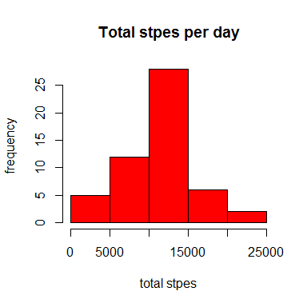
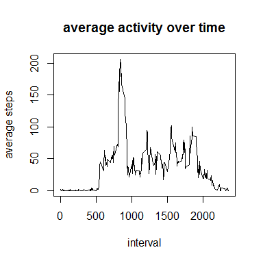
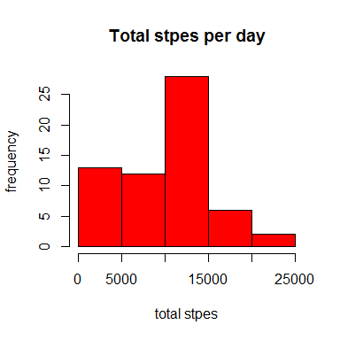
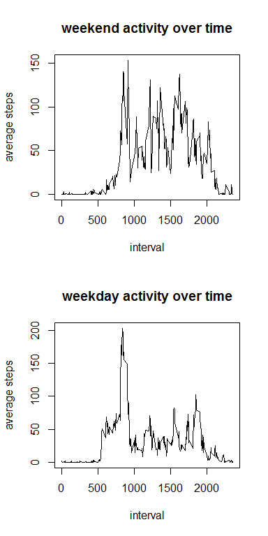

# Reproducible Research: Peer Assessment 1

*Note:Before starting the process, make sure that the "activity.csv"" file is unzipped and is in the working directory.*

*Note: All figures for this report could be found in "/PA1_template_files/figure-html"*

## Loading and preprocessing the data
We can read the data using read.csv(). The output is in the data.frame format which is suitable for our needs. So, no data transfomation is required. The first few lines is shown below:


```r
activity<-read.csv("activity.csv")
head(activity)
```

```
##   steps       date interval
## 1    NA 2012-10-01        0
## 2    NA 2012-10-01        5
## 3    NA 2012-10-01       10
## 4    NA 2012-10-01       15
## 5    NA 2012-10-01       20
## 6    NA 2012-10-01       25
```


## What is mean total number of steps taken per day?
We have to first omit the NA from the data and then using the tapply function we can calculate the total number of steps taken per day. We will put the results in a variable called "total_steps"


```r
temp<-na.omit(activity)
total_steps<-tapply(temp$steps, temp$date, sum)
total_steps<-total_steps[!is.na(total_steps)]
```
Now, we can make a histogram of the data as following:


```r
hist(total_steps, main="Total stpes per day", xlab="total stpes", ylab="frequency", col="red")
```



To calculate the mean and median of the the steps, we can follow the above procedure. However, instead of sum, we have to caluclate the mean and median. We can combine the mean and median into a data.frame called "stats". Here, we have presented the first 10 row's of stats. 


```r
#Calculating the Mean
mean_steps<-tapply(temp$steps, temp$date, mean)
mean_steps<-mean_steps[!is.na(mean_steps)]
#Calculating the Median
median_steps<-tapply(temp$steps, temp$date, median)
median_steps<-median_steps[!is.na(median_steps)]
#Combining the results is a unique data frame
stats<-data.frame(mean_steps = mean_steps, median_stesps= median_steps)
stats[1:10,]
```

```
##            mean_steps median_stesps
## 2012-10-02    0.43750             0
## 2012-10-03   39.41667             0
## 2012-10-04   42.06944             0
## 2012-10-05   46.15972             0
## 2012-10-06   53.54167             0
## 2012-10-07   38.24653             0
## 2012-10-09   44.48264             0
## 2012-10-10   34.37500             0
## 2012-10-11   35.77778             0
## 2012-10-12   60.35417             0
```

Note that, since most of the intervals contain the value 0 for the number of steps, the median number of steps is equal to zero for all days. 

## What is the average daily activity pattern?
The same procedure can be applied to figure out the average activity over days in separate intervals. This time, we have to factor in terms of intervals instead of date. The following code, calculates the avergae activity in each interval and plots a time series of the activity. 


```r
t_steps<-tapply(temp$steps, temp$interval, mean)
plot(as.numeric(names(t_steps)), t_steps, type="l", main="average activity over time", xlab="interval", ylab= "average steps")
```



To calculate the interval that contains the maximum activity we can use the following code:


```r
index<-which.max(t_steps)
t_steps[index]
```

```
##      835 
## 206.1698
```

We can see that the maximum activity happens at the interval 835.

## Imputing missing values
To count the total number of NAs in the data, we can simply use the following code:


```r
sum(is.na(activity$steps))
```

```
## [1] 2304
```

We can see that there are 2304 NA's in the data. 
To fill out the NAs we can follow these steps;
If there is any data for the given day, we replace the NA value with the mean of the day. If there is no data for that given day, we simply replace it with zero. Note that the median of all days were equal to zero. So, replacing a field with zero is equivalent to replacing the field with the median of the day.


```r
for (i in 1:dim(activity)[1]){
  if (is.na(activity[i,1])){
  activity[i, 1]<-0
  if (!is.na(mean_steps[as.character(activity[i,2])])) 
    {activity[i,1]<-mean_steps[activity[i,2]]}
  }
}
```

Exactly like what we did in the previous section, we can make the histogram of the total number of steps and also the table that shows the median and mean. The histogram and the first 10 rows of the mean and median table is shown below:


```r
#Making the histogram
total_steps<-tapply(activity$steps, activity$date, sum)
total_steps<-total_steps[!is.na(total_steps)]
hist(total_steps, main="Total stpes per day", xlab="total stpes", ylab="frequency", col="red")
```



```r
#Calculating the Mean
mean_steps<-tapply(activity$steps, activity$date, mean)
mean_steps<-mean_steps[!is.na(mean_steps)]
#Calculating the Median
median_steps<-tapply(activity$steps, activity$date, median)
median_steps<-median_steps[!is.na(median_steps)]
#Combinig the results in a unique data frame
stats<-data.frame(mean_steps = mean_steps, median_stesps= median_steps)
stats[1:10,]
```

```
##            mean_steps median_stesps
## 2012-10-01    0.00000             0
## 2012-10-02    0.43750             0
## 2012-10-03   39.41667             0
## 2012-10-04   42.06944             0
## 2012-10-05   46.15972             0
## 2012-10-06   53.54167             0
## 2012-10-07   38.24653             0
## 2012-10-08    0.00000             0
## 2012-10-09   44.48264             0
## 2012-10-10   34.37500             0
```


With this strategy the total number of steps per day increases or remain the same but the avergae number of steps per day decreases or remains the same. If there were no data for a given day, then the new average becomes equal to zero, which makes sense.

## Are there differences in activity patterns between weekdays and weekends?
To create a factor containting weekdays and weekend we first extract the weekdays of the date column


```r
day_name<-weekdays(as.Date(activity$date))
```

Now we create a factor based on the fact that day_name is "Saturday", "Sunday" or else.


```r
weekday<-factor(day_name %in% c("Saturday", "Sunday"), levels=c(T,F), labels=c("weekend", "weekdays"))
```

Now we can add this array to the activity data.frame


```r
activity["weekday"]<-weekday
```

We can create two different data frames. One of them for weekdays and the other one for weekends.


```r
activity_weekday<-activity[activity$weekday=="weekdays",]
activity_weekend<-activity[activity$weekday=="weekend",]
```

Now we can plot the activity for weekend and weekdays:


```r
par(mfrow=(c(2,1)))
t_steps<-tapply(activity_weekend$steps, activity_weekend$interval, mean)
plot(as.numeric(names(t_steps)), t_steps, type="l", main="weekend activity over time", xlab="interval", ylab= "average steps")

t_steps<-tapply(activity_weekday$steps, activity_weekday$interval, mean)
plot(as.numeric(names(t_steps)), t_steps, type="l", main="weekday activity over time", xlab="interval", ylab= "average steps")
```



